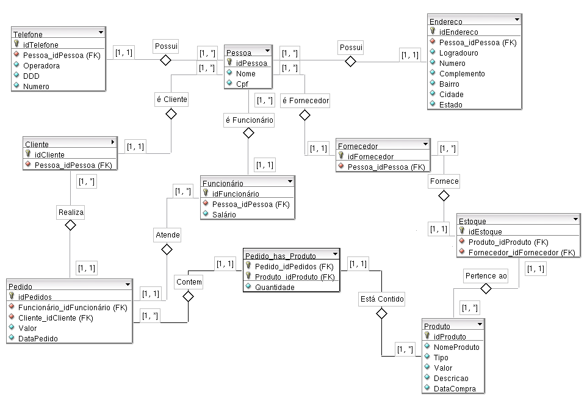

## Exercicio 1:

Deseja-se construir um banco de dados para um sistema de controle de pedidos. Cada cliente faz os pedidos desejados, sendo cada um deles atendido por um funcionário. Cada pedido pode possuir de um a vários produtos e cada produto pode aparecer em diversos pedidos. Faça a representação gráfica dos relacionamentos entres as entidades:

