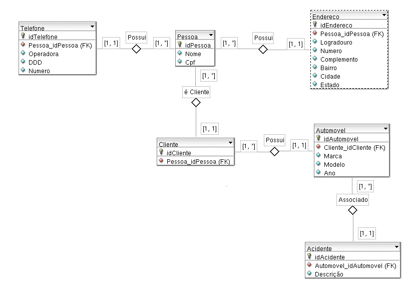

## Exercicio 1:

Construa um modelo ER para uma companhia de seguros de automóveis com um conjunto de clientes,
onde cada um possui um certo número de carros. Cada carro tem um número de acidentes associados a ele.

