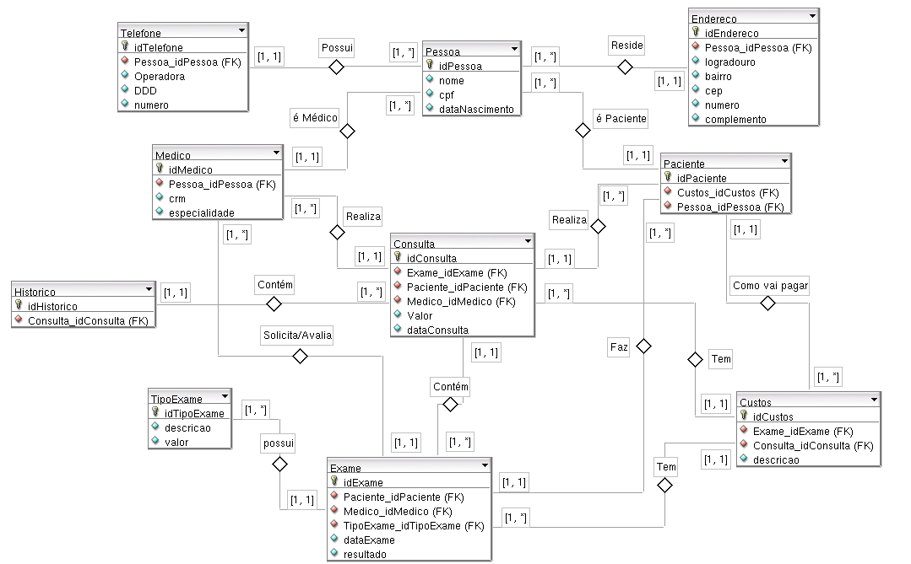

## Atividade 1: Clínica Médica

Uma clínica médica de Natal/RN está precisando controlar os clientes que passam por tratamento
médico todos os dias. Para tal, é preciso manter um registro dos médicos que atendem nessa clínica e os exames realizados por cada cliente.

Requisitos:

a) Um cliente possui nome, endereço, cpf e telefone;

b) Um médico possui nome, crm, especialidade, etc;

c) Um exame possui tipo do exame, data do exame, etc.

d) Como é importante manter um histórico de exames realizado para cada cliente, 
crie um histórico que guarde os dados mais relevantes.

Observação:

• É permitida a inclusão de outros atributos que forem pertinentes no momento da construção do
diagrama (DER).

• É permitida a criação de entidades derivadas/associativas de forma implícita ou explícita.

