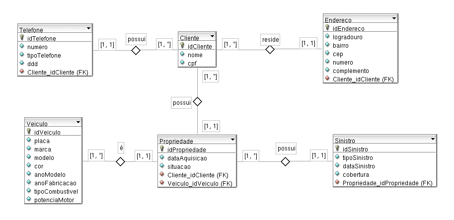

## Atividade 1: Companhia de Seguros

Uma companhia de seguros de Natal/RN está precisando criar um banco de dados para controlar o
cadastro de seus clientes. Além dos clientes, também serão controlados todos os veículos de cada cliente, assim como o histórico de sinistros de cada veículo.

Requisitos:

a) Um cliente possui nome, endereço, cpf e telefone;

b) Um veículo possui placa, marca, modelo, cor, ano de fabricação, ano de modelo, tipo de
combustível, potência do motor, renavam;

c) Um sinistro possui tipo do sinistro, data do sinistro, cobertura (%).

d) Como os veículos podem ser vendidos, crie um histórico que guarde as mudanças de donos de
cada veículo.

Observação:

• É permitida a inclusão de outros atributos que forem pertinentes no momento da construção do
diagrama (DER).

• É permitida a criação de entidades derivadas/associativas de forma implícita ou explícita.

